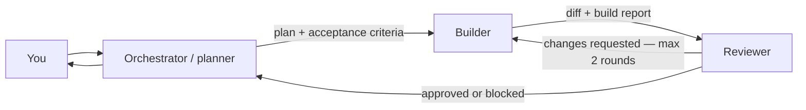

# Minimal Software Factory

A deliberately small SDLC factory using [OpenCode](https://opencode.ai/) for the agents and [Herdr](https://herdr.dev/) for persistent panes, agent state, and handoffs.

You speak only to the orchestrator. It plans the work, starts a builder in Herdr, then starts an independent reviewer. Rejected work returns to the same builder for a bounded correction loop.



## Roles and model tiers

Roles select semantic tiers in `model-tiers.json`; they do not contain model IDs. At startup, `./factory` asks OpenCode for its available catalog and chooses the first available candidate in each tier.

| Role | Tier | Access |
|---|---|---|
| Orchestrator | `state-of-the-art` | Plans and coordinates; may write only run handoffs |
| Builder | `workhorse` | May edit product code and run checks |
| Reviewer | `state-of-the-art` | Reviews and runs checks; may write only review reports |

### Configure tiers

Edit only `model-tiers.json`:

- Change a value under `roles` to assign a different tier to a role.
- Reorder a tier's `candidates` to change preference.
- Add or remove candidates using the exact IDs printed by `opencode models`.
- Run `./factory models` to preview and materialize the resolution.

Current resolution on this machine:

| Tier | Resolved model |
|---|---|
| `state-of-the-art` | `openai/gpt-5.6-sol` |
| `workhorse` | `openai/gpt-5.6-terra` |

Resolved IDs are written under `.factory/runtime/models/` and are gitignored. `opencode.json` reads those transient files; normally you should not edit its model fields.

## Prerequisites

- Herdr 0.8 or newer
- OpenCode 1.18 or newer, already authenticated with at least one candidate in each configured tier
- Python 3.11 or newer
- [uv](https://docs.astral.sh/uv/) to run the launcher and development checks
- The current Herdr OpenCode integration:

```bash
herdr integration install opencode
```

No API keys belong in this repository.

## Start

From this repository:

```bash
herdr
```

Then, inside its shell pane:

```bash
./factory
```

The launcher resolves model tiers, then starts OpenCode directly as the `orchestrator`. Give it a normal request, for example:

```text
Add a health endpoint with focused tests. Do not add dependencies.
```

The orchestrator creates a timestamped directory under `.factory/runs/`, writes the request and plan, loads the project-local Herdr skill, and uses Herdr's native agent commands to create the other OpenCode roles. `./factory dispatch` remains as a narrow wrapper around `herdr agent prompt --wait` so model, duration, state, and report telemetry are captured consistently. Run artifacts are local and gitignored.

## What v1 does

- One user-facing planner/orchestrator
- Configurable `state-of-the-art` and `workhorse` model tiers
- Observable, persistent OpenCode panes in Herdr
- The release-matched Herdr 0.8 agent skill, discoverable by OpenCode
- File-based request, plan, build, and review handoffs
- Machine-readable telemetry plus copy-ready `Factory-*` headers
- At most two correction rounds
- Role-specific OpenCode permissions

## Telemetry

`./factory run new` snapshots the resolved model for every role and starts the total run timer. Each worker dispatch records its elapsed time and Herdr settled state in the run's `telemetry.json`, then prepends headers to the builder or reviewer report:

```text
Factory-Run: 20260811T120000Z-health-endpoint
Factory-Role: builder
Factory-Model-Tier: workhorse
Factory-Model: openai/gpt-5.6-terra
Factory-Agent-Status: done
Factory-Duration: 1m 18.442s
Factory-Duration-Ms: 78442
Factory-Started-At: 2026-08-11T12:00:03.120Z
Factory-Finished-At: 2026-08-11T12:01:21.562Z
Factory-Herdr-Pane: w1:p2
```

Before its final response, the orchestrator renders a run-level header with total elapsed time, verdict, dispatch counts, factory/Herdr/OpenCode versions, and all three resolved models. Herdr 0.8's dispatch result does not expose model token counts or cost, so the factory deliberately does not invent those figures.

## Deliberate non-goals

This version does not create branches or worktrees, commit, push, open pull requests, merge, deploy, update tickets, run CI remotely, keep a database, or schedule multiple tasks. Those are later factory stages, not prerequisites for validating the core interaction model.

## Useful commands

```bash
./factory check
./factory models
herdr agent list
herdr agent read builder --source recent-unwrapped --lines 120
herdr agent read reviewer --source recent-unwrapped --lines 120
uv run pytest
uv run ruff check .
uv run mypy
```

Detach from Herdr with `ctrl+b q`; the panes and agents keep running. Run `herdr` again to reattach.

## Layout

```text
.
├── factory                         # 10-line executable Python entrypoint
├── model-tiers.json                # editable role tiers and ordered candidates
├── model-tiers.schema.json         # tier configuration schema
├── opencode.json                   # roles, resolved model references, permissions
├── pyproject.toml                  # Typer and development dependencies
├── software_factory/               # typed CLI, dispatch telemetry, and model tiers
├── .opencode/skills/herdr/SKILL.md # release-matched Herdr agent skill
├── .factory/
│   ├── prompts/                    # SDLC contracts for the three roles
│   ├── runtime/models/             # gitignored concrete model resolution
│   └── runs/                       # gitignored handoffs and telemetry.json
└── tests/test_factory.py           # focused Python CLI and unit tests
```

The core idea borrowed from Super Simple Software Factory is the clean phase boundary and explicit handoff artifact. This version intentionally leaves deterministic gates and traces for a later iteration; Herdr already provides the agent lifecycle and observable terminal surface needed to test the three-role loop first.
