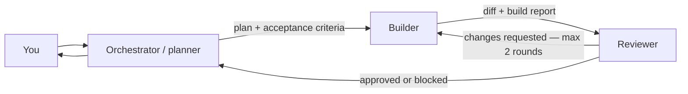

# Minimal Software Factory

A deliberately small SDLC factory using [OpenCode](https://opencode.ai/) for the agents and [Herdr](https://herdr.dev/) for persistent panes, agent state, and handoffs.

You speak only to the orchestrator. It plans the work, starts a builder in Herdr, then starts an independent reviewer. Rejected work returns to the same builder for a bounded correction loop.



## Roles and model tiers

Roles select semantic tiers in `model-tiers.json`; they do not contain model IDs. At startup, `./factory` asks OpenCode for its available catalog and chooses the first available candidate in each tier. The shipped tiers list candidates across several providers (Anthropic, OpenAI, GitHub Copilot, Google, OpenRouter) so the factory resolves for most people out of the box; you only need to edit `model-tiers.json` if none of a tier's candidates are in your catalog or you prefer a different order.

| Role | Tier | Access |
|---|---|---|
| Orchestrator | `state-of-the-art` | Plans and coordinates; may write only run handoffs |
| Builder | `workhorse` | May edit product code and run checks |
| Reviewer | `state-of-the-art` | Reviews and runs checks; may write only review reports |

### Configure tiers

Edit only `model-tiers.json`:

- Change a value under `roles` to assign a different tier to a role.
- Reorder a tier's `candidates` to change preference. The launcher uses the first candidate that appears in your catalog.
- Add or remove candidates using the exact IDs printed by `opencode models`.
- Run `./factory models` to preview and materialize the resolution for your machine.

Resolution depends on which providers you have authenticated in OpenCode, so it differs from machine to machine. Run `./factory models` to see the concrete models chosen for you, for example:

```text
ROLE          TIER              RESOLVED MODEL
orchestrator  state-of-the-art  anthropic/claude-opus-4-5
builder       workhorse         anthropic/claude-sonnet-4-5
reviewer      state-of-the-art  anthropic/claude-opus-4-5
```

If a tier cannot resolve (`no available OpenCode model matches tier ...`), add an ID you actually have from `opencode models` to that tier's `candidates`.

Resolved IDs are written under `.factory/runtime/models/` and are gitignored. `opencode.json` reads those transient files; normally you should not edit its model fields.

## Prerequisites

- [Herdr](https://herdr.dev/) 0.8 or newer, for persistent panes and agent lifecycle
- [OpenCode](https://opencode.ai/) 1.18 or newer, already authenticated with at least one provider (run `opencode auth login`). The shipped tiers cover Anthropic, OpenAI, GitHub Copilot, Google, and OpenRouter, so any one of those is enough to start.
- Python 3.11 or newer
- [uv](https://docs.astral.sh/uv/) to run the launcher and development checks
- The current Herdr OpenCode integration:

```bash
herdr integration install opencode
```

No API keys belong in this repository; OpenCode holds your provider credentials.

Verify everything is wired up before your first real run:

```bash
./factory check
```

This validates the prerequisites and prints the concrete model each role resolved to. If it reports that a tier cannot resolve, edit `model-tiers.json` (see [Configure tiers](#configure-tiers)).

## Start

From this repository:

```bash
herdr
```

Then, inside its shell pane:

```bash
./factory
```

The launcher resolves model tiers, then starts OpenCode directly as the `orchestrator`. Give it a normal request, for example:

```text
Add a health endpoint with focused tests. Do not add dependencies.
```

The orchestrator creates a timestamped directory under `.factory/runs/`, writes the request and plan, loads the project-local Herdr skill, and uses Herdr's native agent commands to create the other OpenCode roles. `./factory dispatch` remains as a narrow wrapper around `herdr agent prompt --wait` so model, duration, state, and report telemetry are captured consistently. Run artifacts are local and gitignored.

## What v1 does

- One user-facing planner/orchestrator
- Configurable `state-of-the-art` and `workhorse` model tiers
- Observable, persistent OpenCode panes in Herdr
- The release-matched Herdr 0.8 agent skill, discoverable by OpenCode
- File-based request, plan, build, and review handoffs
- Machine-readable telemetry plus copy-ready `Factory-*` headers
- At most two correction rounds
- Role-specific OpenCode permissions

## Telemetry

`./factory run new` snapshots the resolved model for every role and starts the total run timer. Each worker dispatch records its elapsed time and Herdr settled state in the run's `telemetry.json`, then prepends headers to the builder or reviewer report:

```text
Factory-Run: 20260811T120000Z-health-endpoint
Factory-Role: builder
Factory-Model-Tier: workhorse
Factory-Model: anthropic/claude-sonnet-4-5
Factory-Agent-Status: done
Factory-Duration: 1m 18.442s
Factory-Duration-Ms: 78442
Factory-Started-At: 2026-08-11T12:00:03.120Z
Factory-Finished-At: 2026-08-11T12:01:21.562Z
Factory-Herdr-Pane: w1:p2
```

Before its final response, the orchestrator renders a run-level header with total elapsed time, verdict, dispatch counts, factory/Herdr/OpenCode versions, and all three resolved models. Herdr 0.8's dispatch result does not expose model token counts or cost, so the factory deliberately does not invent those figures.

## Deliberate non-goals

This version does not create branches or worktrees, commit, push, open pull requests, merge, deploy, update tickets, run CI remotely, keep a database, or schedule multiple tasks. Those are later factory stages, not prerequisites for validating the core interaction model.

## Useful commands

```bash
./factory check
./factory models
herdr agent list
herdr agent read builder --source recent-unwrapped --lines 120
herdr agent read reviewer --source recent-unwrapped --lines 120
uv run pytest
uv run ruff check .
uv run mypy
```

Detach from Herdr with `ctrl+b q`; the panes and agents keep running. Run `herdr` again to reattach.

## Troubleshooting

- **`no available OpenCode model matches tier ...`** — none of that tier's candidates are in your catalog. Run `opencode models` to see what you have, then add one of those IDs to the tier in `model-tiers.json` and rerun `./factory models`.
- **`missing required command: herdr | opencode | uv`** — install the missing tool (see [Prerequisites](#prerequisites)) and make sure it is on your `PATH`.
- **`Herdr's OpenCode integration is not current`** — run `herdr integration install opencode`.
- **`the project Herdr skill does not match the installed release`** — your Herdr version ships a different agent skill than the one checked in. Refresh it with `herdr --skill > .opencode/skills/herdr/SKILL.md`.
- **`start Herdr in this directory, then run ./factory in its shell pane`** — you launched `./factory` outside a Herdr pane. Start `herdr` first, then run `./factory` inside its shell.

## Layout

```text
.
├── factory                         # 10-line executable Python entrypoint
├── model-tiers.json                # editable role tiers and ordered candidates
├── model-tiers.schema.json         # tier configuration schema
├── opencode.json                   # roles, resolved model references, permissions
├── pyproject.toml                  # Typer and development dependencies
├── software_factory/               # typed CLI, dispatch telemetry, and model tiers
├── .opencode/skills/herdr/SKILL.md # release-matched Herdr agent skill
├── .factory/
│   ├── prompts/                    # SDLC contracts for the three roles
│   ├── runtime/models/             # gitignored concrete model resolution
│   └── runs/                       # gitignored handoffs and telemetry.json
└── tests/test_factory.py           # focused Python CLI and unit tests
```

The core idea borrowed from Super Simple Software Factory is the clean phase boundary and explicit handoff artifact. This version intentionally leaves deterministic gates and traces for a later iteration; Herdr already provides the agent lifecycle and observable terminal surface needed to test the three-role loop first.

## License

Released under the [MIT License](LICENSE).
